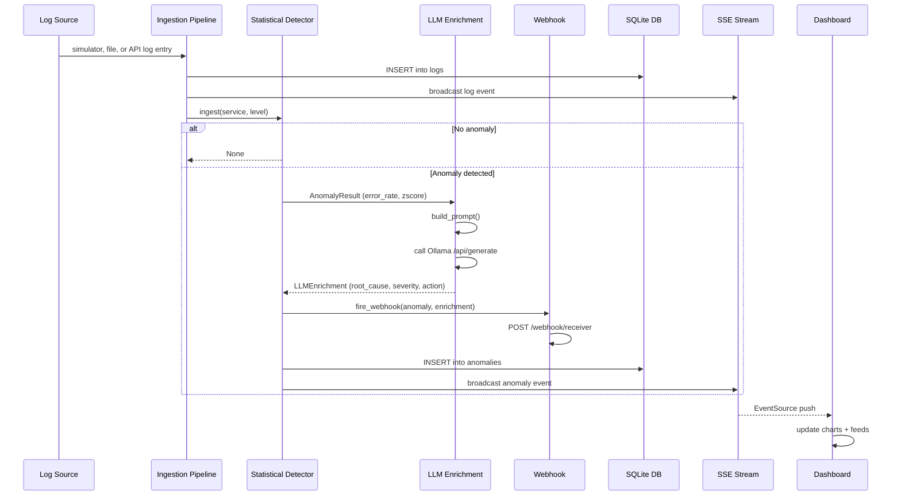
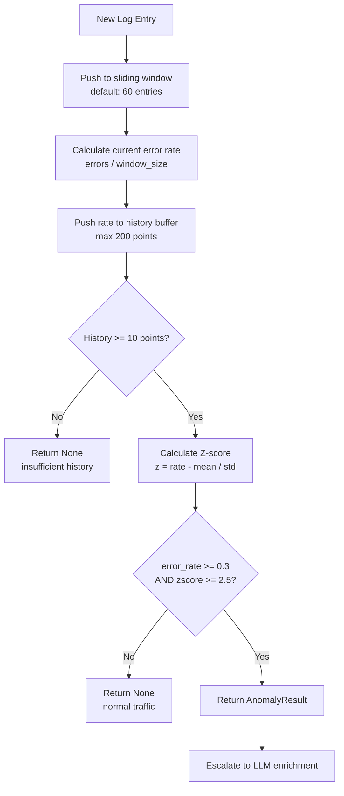
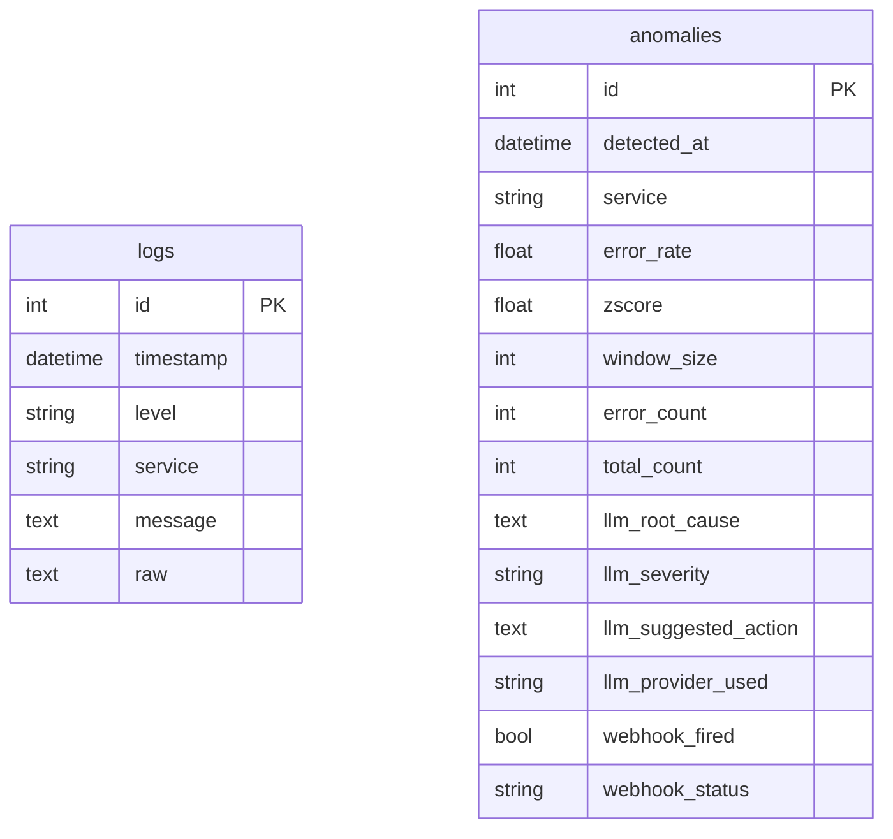
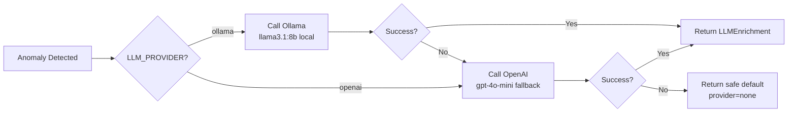

# LogPulse — Architecture Document

> **Intelligent Observability & Event Watchdog**
> Python · FastAPI · Ollama · SQLite · Docker

---

## System Overview

LogPulse is a real-time log observability platform that combines statistical anomaly detection with local LLM semantic enrichment. The system ingests application logs, applies a sliding-window Z-score gate to detect error spikes, and escalates confirmed anomalies to a local LLM for root cause analysis — all without leaving your infrastructure.

---

## High-Level Architecture

```mermaid
graph TB
    subgraph Ingestion
        SIM[Log Simulator] -->|async generator| PIPE[Ingestion Pipeline]
        FILE[Log File Tailer] -->|parsed raw lines| PIPE
        APIIN[POST /api/logs] -->|raw or structured logs| PIPE
    end

    subgraph Detection
        PIPE -->|log event| STAT[Statistical Gate<br/>Z-score + Sliding Window]
        STAT -->|anomaly detected| LLM[LLM Enrichment<br/>Ollama llama3.1:8b]
        STAT -->|no anomaly| DB_LOG[(logs table)]
    end

    subgraph Alerting
        LLM -->|enriched anomaly| HOOK[Webhook Alerting]
        HOOK -->|POST| RECV[/webhook/receiver]
    end

    subgraph Persistence
        LLM --> DB_ANO[(anomalies table)]
        PIPE --> DB_LOG
    end

    subgraph Dashboard
        DB_LOG --> SSE[SSE Broadcast]
        DB_ANO --> SSE
        SSE -->|EventSource| BROWSER[Browser Dashboard<br/>Chart.js + Jinja2]
    end
```

---

## Data Flow



---

## Anomaly Detection Algorithm



---

## Module Responsibilities

| Module | Responsibility |
|---|---|
| `ingestion/simulator.py` | Generates synthetic log stream with configurable spike probability |
| `ingestion/parser.py` | Normalizes JSON, raw text, and structured API log payloads |
| `ingestion/pipeline.py` | Orchestrates simulator and file log sources, calls `on_log` handler |
| `detection/detector.py` | Stateful sliding-window Z-score anomaly detector, one instance per app lifetime |
| `llm/enrichment.py` | Ollama/OpenAI LLM calls, prompt construction, JSON response parsing |
| `alerting/webhook.py` | Builds alert payload, fires to webhook receiver |
| `db/models.py` | SQLAlchemy async models: `LogEntry`, `Anomaly` |
| `db/crud.py` | All DB read/write operations |
| `api/app.py` | FastAPI app, API log ingestion, SSE broadcast, route handlers, pipeline orchestration |
| `dashboard/templates/` | Jinja2 HTML template, Chart.js, SSE client |
| `config.py` | Central settings loaded from `.env` |

---

## Database Schema



---

## LLM Provider Strategy

LLM enrichment is bounded by `LLM_ENRICHMENT_TIMEOUT_SECONDS`. If enrichment
times out or all providers fail, the anomaly is still persisted with a safe
fallback analysis so detection and alerting continue.



---

## Tech Stack

| Layer | Technology | License |
|---|---|---|
| API Framework | FastAPI 0.111 | MIT |
| ASGI Server | Uvicorn | BSD |
| Templating | Jinja2 | BSD |
| SSE | sse-starlette | BSD |
| Database | SQLite + SQLAlchemy async | MIT / PSF |
| Statistical Analysis | NumPy | BSD |
| LLM (primary) | Ollama `llama3.1:8b` | MIT |
| LLM (fallback) | OpenAI `gpt-4o-mini` | Paid API |
| HTTP Client | HTTPX | BSD |
| Charts | Chart.js 4.4 | MIT |
| Containerization | Docker Engine | Apache 2.0 |
| Testing | pytest + pytest-asyncio | MIT |

---

## Deployment

Single command deployment:

```bash
docker-compose up
```

Services started:
- `logpulse` — FastAPI app on port 8000
- `ollama` — Local LLM server on port 11434

Dashboard: **http://localhost:8000**
API docs: **http://localhost:8000/docs**
